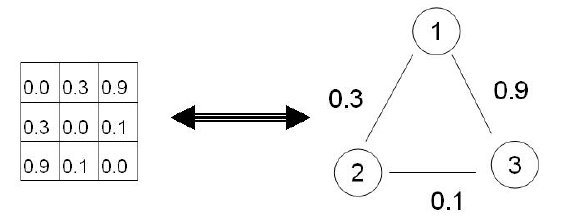

# Background Information

## Graph Theory and Linear Algebra

### Similarity Graphs

Given a dataset $x_1,...,x_n$ and a measure of similarity $s_{ij}\geq0$ between all pairs of points $x_i$ and $x_j$ in the set, the goal of clustering is to divide observations into groups such that points in the same group are similar, and points in different groups are dissimilar. A good way of representing similarity between observations is through a **similarity graph**, notated as G=(V,E). Each vertex, $v_i\in V$, represents an observationin the dataset. Two vertices are connected by an edge when their similarity $s_{ij}$ exceeds a threshold value. An edge is weighted by $s_{ij}$; the higher the similarity, the higher the weight and vice-versa.

Our clustering problem now is to find a separation of the similarity graph such that edges between different groups have low weights, and edges within the same group have high weights.

### Adjacency Matrices

An adjacency matrix is a numerical represenation of a similarity graph. In our case, we have a weighted adjacency matrix notated as $W=(w_{ij})_{i,j=1,..,n}$.  If $w_{ij}=0$, vertices $v_i$ and $v_j$ are not connected by an edge.

```{r,echo=FALSE,include=FALSE}
nodes<-read.csv("Dataset1-Media-Example-NODES.csv", header=T, as.is=T)
links<-read.csv("Dataset1-Media-Example-EDGES.csv", header=T, as.is=T)
library(igraph)
net<-graph.data.frame(links, nodes, directed=F)
plot(net,edge.arrow.size=1,vertex.size=20,vertex.color="pink",vertex.label.cex=0.6)
as_adjacency_matrix(net, type = c("both", "upper", "lower"), attr = NULL,
  edges = FALSE, names = TRUE, sparse = igraph_opt("sparsematrices"))
```

### Laplacians

## Spectral Clustering 

# Exercise 
---
title: "Spectral Clustering Practice"
author: "Andira Putri"
output: pdf_document
---

# 1. Background Information

## 1.1 Graph Theory and Linear Algebra

### Similarity Graphs

Given a dataset $x_1,...,x_n$ and a measure of similarity $s_{ij}\geq0$ between all pairs of points $x_i$ and $x_j$ in the set, the goal of clustering is to divide observations into groups such that points in the same group are similar, and points in different groups are dissimilar. A good way of representing similarity between observations is through a **similarity graph**, notated as G=(V,E). Each vertex, $v_i\in V$, represents an observationin the dataset. Two vertices are connected by an edge when their similarity $s_{ij}$ exceeds a threshold value. An edge is weighted by $s_{ij}$; the higher the similarity, the higher the weight and vice-versa. Our clustering problem now is to find a separation of the similarity graph such that edges between different groups have low weights, and edges within the same group have high weights.

An **adjacency matrix** is a numerical represenation of a similarity graph. In our case, we have a weighted adjacency matrix notated as $W=(w_{ij})_{i,j=1,..,n}$.  If $w_{ij}=0$, vertices $v_i$ and $v_j$ are not connected by an edge. An example of a similarity graph and its adjacency matrix is shown in Figure 1.



```{r network,echo=FALSE,include=FALSE}
# playing around with network visualization tools
nodes<-read.csv("Dataset1-Media-Example-NODES.csv", header=T, as.is=T)
links<-read.csv("Dataset1-Media-Example-EDGES.csv", header=T, as.is=T)
library(igraph)
net<-graph.data.frame(links, nodes, directed=F)
plot(net,edge.arrow.size=1,vertex.size=20,vertex.color="pink",vertex.label.cex=0.6)
as_adjacency_matrix(net, type = c("both", "upper", "lower"), attr = NULL,
  edges = FALSE, names = TRUE, sparse = igraph_opt("sparsematrices"))
```

There are several different types of similarity graphs. The types described below are commonly used for spectral clustering.

$\epsilon$-Neighborhood Graph: We connect the observations whose pairwise distances are smaller than $\epsilon$. Distances between connected points cannot exceed $\epsilon$, so weighting the edges would not give more information about the data to the graph. For this reason, the $\epsilon$-neighborhood graph is considered an unweighted graph.

K-Nearest Neighbor Graph: 

The Fully Connected Graph: All vertices are connected with positive similarity to each other. All edges are weighted by $s_{ij}$. This type of graph is only useful if it represents local neigborhoods. A good example of a useful fully connected graph is the Gaussian similarity function, where a parameter $\sigma$ controls the width of the neighborhoods; the parameter has a similar role to $\epsilon$ in the first type of graph. 

### Graph Laplacians

## 1.2 Spectral Clustering 

# Exercises 

http://lasa.epfl.ch/teaching/lectures/ML_MSc_Advanced/Exercises/Ex_ML_SpectralClustering.pdf
---
title: "Spectral Clustering"
author: "Andira Putri"
output: pdf_document
---

# 1. Graph Theory and Linear Algebra

## Similarity Graphs

Given a dataset $x_1,...,x_n$ and a measure of similarity $s_{ij}\geq0$ between all pairs of points $x_i$ and $x_j$ in the set, the goal of clustering is to divide observations into groups such that points in the same group are similar, and points in different groups are dissimilar. A good way of representing similarity between observations is through a **similarity graph**, notated as G=(V,E). Each vertex, $v_i\in V$, represents an observationin the dataset. Two vertices are connected by an edge when their similarity $s_{ij}$ exceeds a threshold value. An edge is weighted by $s_{ij}$; the higher the similarity, the higher the weight and vice-versa. Our clustering problem now is to find a separation of the similarity graph such that edges between different groups have low weights, and edges within the same group have high weights.

An **adjacency matrix** is a numerical represenation of a similarity graph. In our case, we have a weighted adjacency matrix notated as $W=(w_{ij})_{i,j=1,..,n}$.  If $w_{ij}=0$, vertices $v_i$ and $v_j$ are not connected by an edge. An example of a similarity graph and its adjacency matrix is shown in Figure 1.


There are several different types of similarity graphs. The types described below are commonly used for spectral clustering. 

#### $\epsilon$-Neighborhood Graph

We connect the observations whose pairwise distances are smaller than $\epsilon$. Distances between connected points cannot exceed $\epsilon$, so weighting the edges would not give more information about the data to the graph. For this reason, the $\epsilon$-neighborhood graph is considered an unweighted graph.

#### K-Nearest Neighbor (KNN) Graph

In this graph, the goal is to connect vertex $v_i$ with vertex $v_j$ if $v_j$ is among is among the k-th smallest distances from $v_i$ to other objects from the dataset. After connecting the two vertices, the edge is weighted by the similarity of their endpoints. KNN graphs are directed graphs since the relationship between vertices is not symmetric- however, in most cases, we just ignore the direction aspect of the edges and view KNN graphs as undirected.

#### The Fully Connected Graph

All vertices are connected with positive similarity to each other. All edges are weighted by $s_{ij}$. This type of graph is only useful if it represents local neigborhoods. A good example of a useful fully connected graph is the Gaussian similarity function, where a parameter $\sigma$ controls the width of the neighborhoods; the parameter has a similar role to $\epsilon$ in the first type of graph. 

## Graph Laplacians

Graph Laplacian matrices are the main tools for spectral clustering. As we define the different graph Laplacians, we always assume that G is an undirected graph $G=(V,E)$ with a weighted matrix W, where $w_{ij}=w_{ji}\geq 0$. We also assume that the eigenvectors of a matrix are not normalized; a constant eigenvector and a scalar multiple of it will be considered the same. Finally, we define the degree matrix $D$. The degree of a vertex is given by $d_i=\sum^n_{j=1}w_{ij}$, and $D$ is a diagonal matrix with the degrees $d_1,...,d_n$ on its diagonal.

#### The Unnormalized Graph Laplacian

The Unnormalized Graph Laplacian matrix $L$ is defined as $L=D-W$. The matrix $L$ has the following properties:

1. For every vector $f\in R^n$, where R is the set of real numbers, we have: $f'Lf=\frac{1}{2}\sum^n_{i,j=1}w_{ij}(f_i-f_j)^2$.

2. L is symmetric and positive semidefinite. Positive semidefinite means that for a square matrix z, $z^TLz$ is strictly positive for every non-zero column vector in z.

3. The smallest eigenvalue of L is 0, with a corresponding eigenvector of the constant one vector.

4. L has n non-negative, real-valued eigenvalues $0=\lambda_1\leq\lambda_2\leq...\leq\lambda_n$.

5. The multiplicity k of the eigenvalue 0 of $L$ equals the number of connected components $A_1,...,A_k$ in the graph. The eigenspace of eigenvalue 0 is spanned by the indicator vectors $1_{A_1},...,1_{A_k}$.

#### Normalized Graph Laplacian

# 2. Spectral Clustering 

Now, we present two commonly-used spectral clustering algorithms using both unnmormalized and normalized graph Laplacians.

#### Unnormalized Spectral Clustering - Algorithm

#### Normalized Spectral Clustering - Algorithm

# Exercises 

http://lasa.epfl.ch/teaching/lectures/ML_MSc_Advanced/Exercises/Ex_ML_SpectralClustering.pdf
